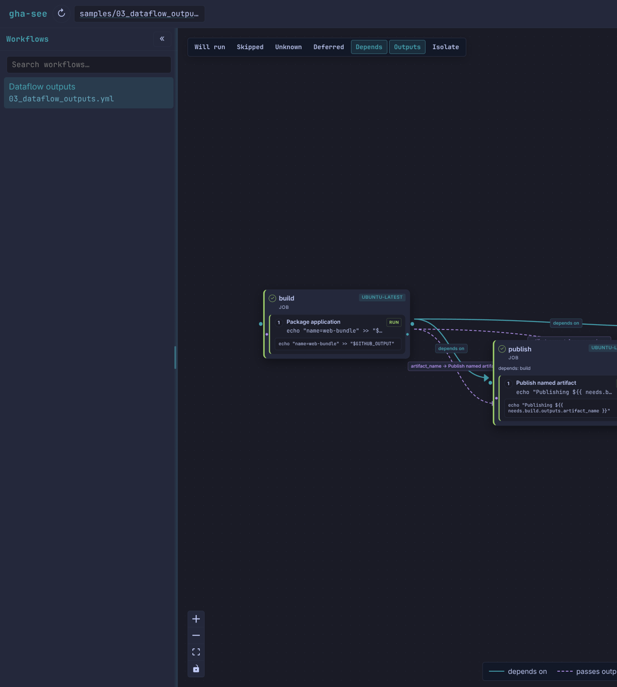

# gha-see

Offline GitHub Actions visualizer. Never runs a workflow.

[](https://github.com/train-dev-bot/gha-see/actions/workflows/ci.yml)

## TL;DR

```bash
git clone https://github.com/train-dev-bot/gha-see.git
cd gha-see
cargo run -- samples/
```

That starts the local UI on the sample workflows. Use `--no-open` if you do not want a browser window. Point `gha-see` at a file or a `.github/workflows` directory for your own repo.




**gha-see** reads workflow YAML, maps `needs:`, traces job outputs, and what-if evaluates `if:` against a mock event. It is not a runner and not `act`. It does not invoke GitHub Actions, Docker, or any step from your YAML.

Paste a workflow and **Analyze** without writing disk — that stays in memory until you **Save**.

**Fetch** (optional, explicit) downloads the repos behind remote `uses:` into `~/.cache/gha-see/` so their `action.yml` / workflow YAML can be read. It still does not run them.

## Install

```bash
cargo install gha-see
gha-see path/to/.github/workflows
```

Or clone this repo and `cargo run -- samples/` for the samples walkthrough.

## Themes

The color palettes are inspired by [Omarchy](https://omarchy.org) OS themes (Tokyo Night, Gruvbox, Catppuccin, Everforest, and the rest of that catalog).

## Later

Opening a GitHub repository URL instead of a local path is not built yet. Today you clone or point at files on disk.

## Safety

gha-see only reads and reasons about workflow definitions. It never executes a step, a `uses:` action, or a container. Normal analysis is offline. **Fetch** is the only network path, and it only stores inert GitHub archives under `~/.cache/gha-see/` (Linux). Malformed YAML becomes a finding (`GHA_YAML`) instead of a crash.

What-if is honest about limits: conditions it cannot resolve become **Unknown**, not a guessed skip. `strategy.matrix` expands up to 256 instances per job. Constructs it cannot expand yet are **Deferred**, shown rather than hidden. The [`samples/`](samples/) pack is the walkthrough (`samples/README.md`).
